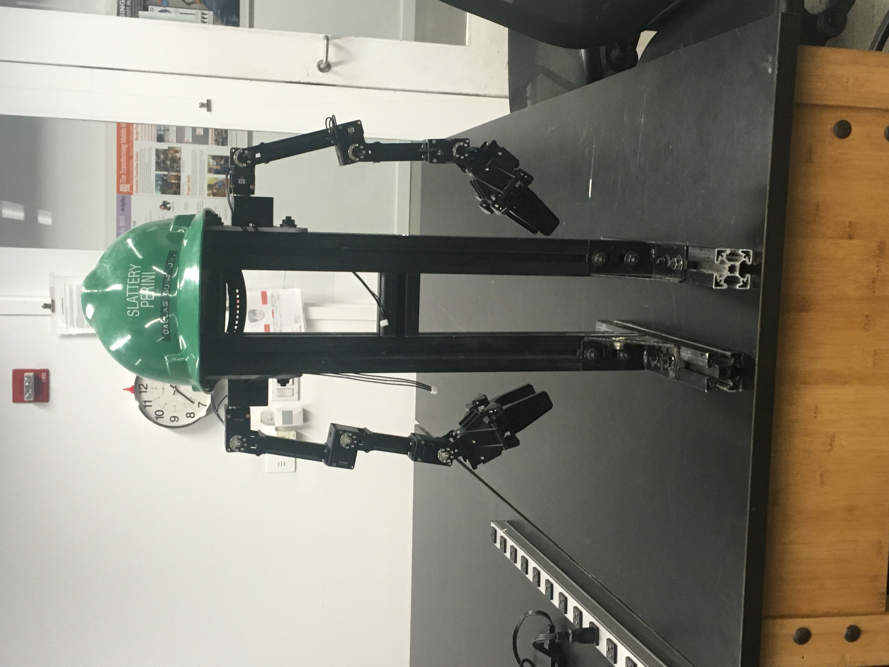

# MarvinARM

by Do Hyung (Dave) Kwon and Rose Gebhardt

## Requirement
```
ROS Melodic
Azure Kinect SDK
Azure Kinect ROS driver
Openmanipulator X
```
## Installation
```
cd ~/catkin_ws/src
git clone https://github.com/thedavekwon/MarvinARM.git
rosdep install --from-paths MarvinARM --ignore-src -r -y
cd ~/catkin_ws
catkin_make
```

### Install rosdep 
```
# ROS Noetic
sudo apt-get install python3-rosdep
# ROS Melodic and earlier
sudo apt-get install python-rosdep
```
## Usage
```
roslaunch mimic mimic.launch

# for launching gazebo
roslaunch mimic mimic_gazebo.launch
```
## Sources
1. [ROBOTIS-GIT/open_manipulator](https://github.com/ROBOTIS-GIT/open_manipulator)
2. [microsoft/Azure_Kinect_ROS_Driver](https://github.com/microsoft/Azure_Kinect_ROS_Driver)
